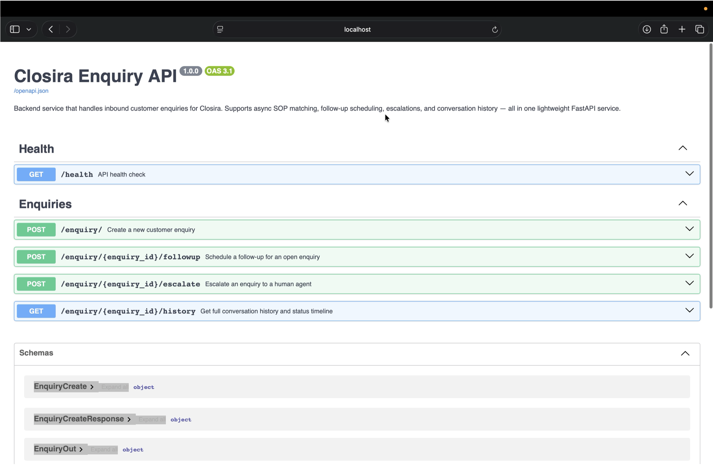
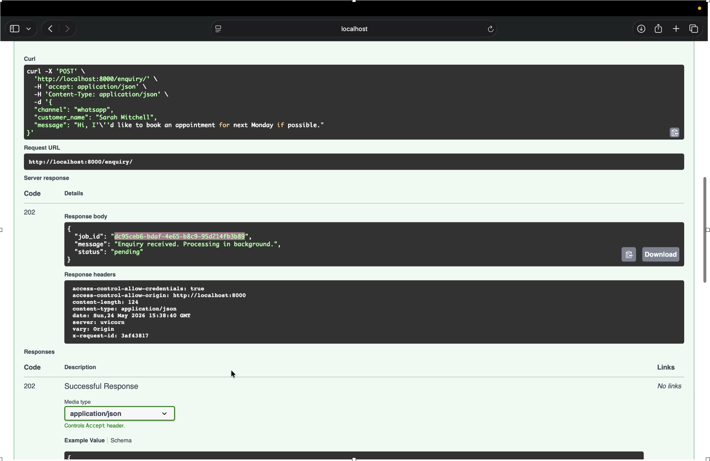
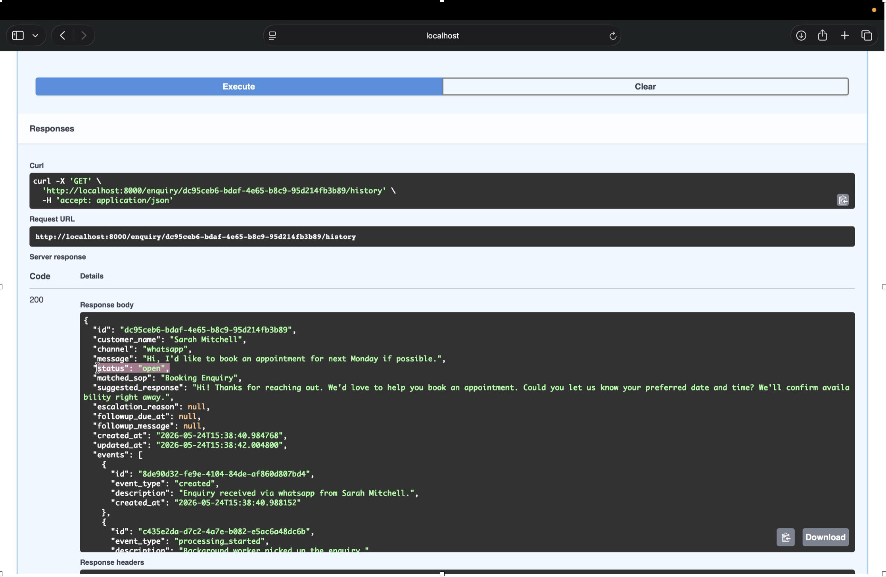
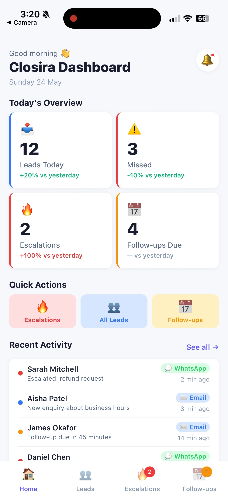
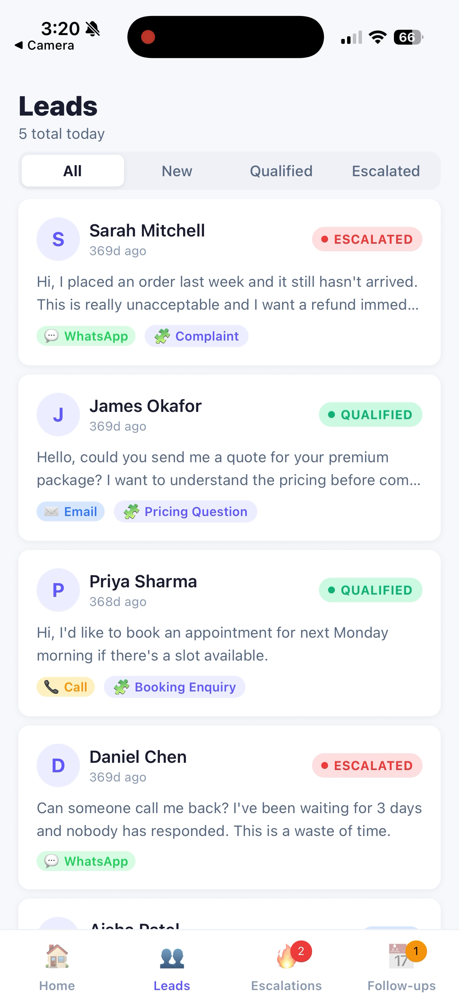
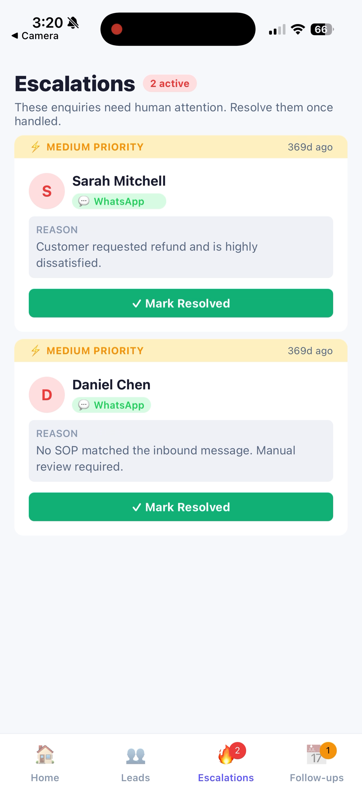
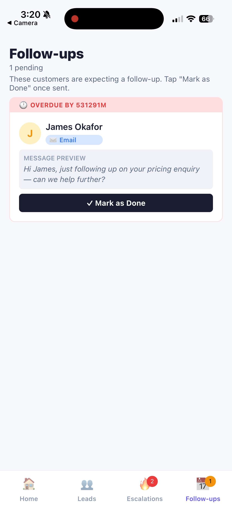

# Closira — Customer Enquiry Management Platform

<div align="center">


<h3>Full-Stack Engineering Internship Assignment</h3>

<p>
A production-inspired customer enquiry management platform built with FastAPI and React Native.
</p>

<p>
  
  
  
  
  
  
</p>

<p>
  
  
  
</p>

</div>

---

## Demo Walkthrough

A short walkthrough covering:

* Backend API flow
* Asynchronous SOP processing
* Escalation handling
* Mobile dashboard functionality
* Engineering trade-offs and architectural decisions

---

## Project Highlights

* FastAPI backend with asynchronous enquiry processing
* SOP-based classification and escalation workflow
* Structured event timeline and immutable audit history
* React Native mobile dashboard built with Expo
* Follow-up scheduling and escalation management
* Modular backend and reusable frontend component architecture
* Swagger API documentation with example payloads
* Realistic mock data structured identically to backend responses
* Production-inspired engineering trade-offs and documentation

---

## Screenshots

### Backend API

#### Full Swagger API Overview

<p align="center">
  
</p>

#### Creating a New Enquiry

<p align="center">
  
</p>

#### Enquiry History and SOP Timeline

<p align="center">
  
</p>

---

### Mobile Dashboard

<p align="center">
  
  
  
</p>

<p align="center">
  
</p>

---

## What This Project Is

Closira is a customer communication platform designed for small and medium businesses handling inbound enquiries across WhatsApp, email, and phone calls.

This repository contains a complete full-stack implementation built as part of the engineering internship assignment.

The project includes:

* A **FastAPI backend** responsible for receiving customer enquiries, asynchronously matching them against predefined SOPs, managing escalations, and maintaining a full event timeline.
* A **React Native mobile dashboard** where business operators can monitor conversations, review escalations, track follow-ups, and inspect the complete enquiry history.

Both applications are independently runnable and intentionally designed without Docker or external infrastructure dependencies to keep local setup simple.

---

## Repository Structure

```text
closira/
├── backend/     # FastAPI backend + async processing pipeline
└── frontend/    # React Native (Expo) mobile dashboard
```

---

# Backend

## Backend Overview

The backend simulates Closira’s core enquiry processing pipeline.

When a customer message arrives:

1. The API immediately accepts the request and returns a job ID.
2. A background task asynchronously processes the enquiry.
3. The enquiry is matched against predefined SOP rules.
4. Matching enquiries receive suggested responses automatically.
5. Unmatched enquiries are escalated for human review.
6. Every action is recorded as an immutable timeline event.

The backend was intentionally structured around modular components so business logic, background processing, database access, and API routing remain isolated and easy to extend.

---

## Backend Architecture

```text
Customer Message
      │
      ▼
POST /enquiry/  ──── returns immediately (202 Accepted)
      │
      ▼
FastAPI Background Task
      │
      ├── Opens independent database session
      ├── Sets enquiry status = processing
      ├── Runs SOP keyword matching engine
      │
      ├── Match found?
      │     ├── YES → suggested response + status=open
      │     └── NO  → auto-escalate for manual review
      │
      └── Writes immutable EnquiryEvent timeline records
```

---

## Running the Backend

> **Requirements:** Python 3.9+

```bash
cd backend

# Create and activate virtual environment
python -m venv venv
source venv/bin/activate        # Windows: venv\Scripts\activate

# Install dependencies
pip install -r requirements.txt

# Start FastAPI server
uvicorn app.main:app --reload
```

### Backend URLs

| Service      | URL                                                        |
| ------------ | ---------------------------------------------------------- |
| API Base     | [http://localhost:8000](http://localhost:8000)             |
| Swagger Docs | [http://localhost:8000/docs](http://localhost:8000/docs)   |
| ReDoc        | [http://localhost:8000/redoc](http://localhost:8000/redoc) |

The SQLite database file (`closira.db`) is automatically created on first startup.

---

## API Endpoints

| Method | Endpoint                 | Description                                         |
| ------ | ------------------------ | --------------------------------------------------- |
| `GET`  | `/health`                | API and database health check                       |
| `POST` | `/enquiry/`              | Create a new customer enquiry                       |
| `POST` | `/enquiry/{id}/followup` | Schedule a follow-up                                |
| `POST` | `/enquiry/{id}/escalate` | Escalate an enquiry to a human agent                |
| `GET`  | `/enquiry/{id}/history`  | Retrieve complete conversation history and timeline |

The API returns structured validation errors (`422`) for invalid input and meaningful `404` responses for missing records.

---

## SOP Matching Engine

The SOP engine lives inside:

```text
backend/app/core/sop_engine.py
```

The matcher uses deterministic keyword matching against predefined Standard Operating Procedures.

Before matching:

* messages are lowercased
* punctuation is stripped
* keywords are normalized

This ensures messages like:

```text
"BOOKING??"
```

and:

```text
"booking"
```

produce identical matches.

### Supported SOPs

| SOP                 | Trigger Keywords                                         |
| ------------------- | -------------------------------------------------------- |
| Booking Enquiry     | book, schedule, appointment, reserve, availability, slot |
| Pricing Question    | price, cost, quote, fee, rates, budget                   |
| Complaint           | complaint, unhappy, issue, refund, angry, frustrated     |
| After-Hours Message | urgent, emergency, asap, tonight, midnight               |
| General Info        | info, details, service, product, hours, location         |

If no SOP matches, the enquiry is automatically escalated.

The matching engine was intentionally isolated so it can later be replaced with:

* an LLM pipeline
* semantic embeddings
* or a trained text classifier

without modifying API routes or database logic.

---

## Database Design

The backend uses SQLite with SQLAlchemy ORM.

### Tables

#### `enquiries`

Stores the current state of each inbound enquiry.

| Column               | Purpose                               |
| -------------------- | ------------------------------------- |
| `id`                 | UUID primary key                      |
| `customer_name`      | Customer identity                     |
| `channel`            | whatsapp / email / call               |
| `message`            | Raw inbound message                   |
| `status`             | Current workflow status               |
| `matched_sop`        | SOP matched by worker                 |
| `suggested_response` | Generated SOP response                |
| `escalation_reason`  | Manual or automatic escalation reason |
| `followup_due_at`    | Follow-up timestamp                   |
| `followup_message`   | Follow-up content                     |
| `created_at`         | Creation timestamp                    |
| `updated_at`         | Auto-updated timestamp                |

---

#### `enquiry_events`

Append-only audit timeline storing every workflow event.

| Column        | Purpose                          |
| ------------- | -------------------------------- |
| `id`          | UUID primary key                 |
| `enquiry_id`  | Linked enquiry                   |
| `event_type`  | Event category                   |
| `description` | Human-readable event description |
| `created_at`  | Event timestamp                  |

The events table is intentionally immutable.
Rows are inserted only — never updated or deleted.

This provides:

* a complete audit trail
* simple timeline reconstruction
* easier debugging
* predictable history queries

---

## Engineering Decisions & Trade-offs

### FastAPI BackgroundTasks vs Celery

I chose FastAPI’s built-in `BackgroundTasks` instead of Celery for this assignment.

### Why

* Zero infrastructure setup
* No Redis or RabbitMQ dependency
* Easier local development
* Simpler deployment model for a prototype

### Trade-off

Background tasks are tied to the API process.
If the server restarts while a task is running, the task is lost.

In production, Celery + Redis would be the correct architecture.

The processing logic is fully isolated inside:

```text
workers/processor.py
```

so migrating later would require minimal routing changes.

---

### SQLite vs PostgreSQL

SQLite was selected intentionally for:

* zero setup
* single-file persistence
* easier inspection
* simpler local onboarding

The database layer is abstracted through SQLAlchemy.
Migrating to PostgreSQL would primarily involve replacing the database connection string.

---

### Structured JSON Logging

The backend emits structured JSON logs instead of plain-text logs.

Benefits:

* easier debugging
* machine-readable output
* log aggregation compatibility
* grep/jq friendliness
* production observability readiness

Logging configuration lives inside:

```text
backend/app/core/logger.py
```

---

## Testing the API

The repository includes:

```text
backend/api_tests.http
```

which can be executed directly inside VS Code using the REST Client extension.

### Example cURL Workflow

```bash
# Health check
curl http://localhost:8000/health

# Create enquiry
curl -X POST http://localhost:8000/enquiry/ \
  -H "Content-Type: application/json" \
  -d '{"customer_name":"Sarah Mitchell","channel":"whatsapp","message":"I would like to schedule an appointment for Monday."}'

# Fetch enquiry history
curl http://localhost:8000/enquiry/{job_id}/history
```

---

# Frontend

## Frontend Overview

The frontend is a React Native mobile dashboard built with Expo.

The application gives business operators a centralized interface for:

* monitoring customer conversations
* reviewing escalations
* managing follow-ups
* inspecting SOP matches
* viewing operational activity

The frontend was intentionally designed using reusable components and centralized design tokens to keep the UI scalable and maintainable.

---

## Running the Frontend

> **Requirements:** Node.js 18+ and Expo Go

```bash
cd frontend

npm install
npx expo start
```

### Running Options

| Platform      | Action                      |
| ------------- | --------------------------- |
| iOS / Android | Scan QR code using Expo Go  |
| Browser       | Press `w` after Expo starts |

---

## Frontend Screens

| Screen              | Purpose                               |
| ------------------- | ------------------------------------- |
| Dashboard           | Overview metrics and recent activity  |
| Leads               | Inbound lead management               |
| Escalations         | Active escalated conversations        |
| Follow-ups          | Pending scheduled actions             |
| Conversation Detail | Full enquiry timeline and SOP details |

---

## Frontend Architecture

The UI is split into reusable component groups.

```text
components/
├── common/
├── dashboard/
├── leads/
├── escalations/
└── followups/
```

### Shared Components

| Component        | Purpose                            |
| ---------------- | ---------------------------------- |
| `ChannelBadge`   | WhatsApp / Email / Call indicators |
| `StatusBadge`    | Status labels across screens       |
| `EmptyState`     | Empty list placeholders            |
| `LeadCard`       | Reusable enquiry cards             |
| `EscalationCard` | Escalation management UI           |
| `FollowUpCard`   | Follow-up tracking UI              |

The frontend uses:

* centralized colour tokens
* reusable helpers
* shared badge logic
* isolated rendering components

which keeps the screens themselves lightweight.

---

## Mock Data Strategy

All frontend mock data lives inside:

```text
frontend/src/mock/
```

The mock datasets intentionally mirror backend API responses exactly.

This includes:

* field names
* enum values
* timestamps
* object structure

This design allows the frontend to switch from mock imports to real API calls with minimal changes.

---

## Styling System

The frontend uses React Native `StyleSheet` with centralized design tokens.

All:

* colours
* spacing values
* font sizes
* shadows
* border radii

are defined inside:

```text
frontend/src/utils/theme.js
```

### Why StyleSheet instead of Tailwind / NativeWind?

For this project:

* no additional compiler setup was needed
* Expo compatibility stayed simple
* tokens remained centralized
* components stayed self-contained

For a single-developer prototype, reducing tooling complexity was the better trade-off.

---

# Known Limitations

The current implementation focuses on demonstrating:

* backend workflows
* asynchronous processing
* API design
* mobile dashboard architecture
* modular engineering structure

Some production concerns were intentionally simplified for the scope of the assignment.

| Limitation                                 | Production Approach                 |
| ------------------------------------------ | ----------------------------------- |
| No authentication                          | JWT-based auth and protected routes |
| No tenant isolation                        | Add `business_id` filtering         |
| Background tasks are not persistent        | Celery + Redis queue                |
| Follow-up scheduler only stores timestamps | Scheduled worker / Celery Beat      |
| Frontend uses mock data                    | Replace imports with fetch calls    |
| SOP matching is keyword-based              | LLM or classifier pipeline          |

---

# Tech Stack

| Layer             | Technology              |
| ----------------- | ----------------------- |
| Backend Framework | FastAPI                 |
| ORM               | SQLAlchemy              |
| Validation        | Pydantic                |
| Database          | SQLite                  |
| Async Processing  | FastAPI BackgroundTasks |
| Mobile Framework  | React Native + Expo     |
| Navigation        | React Navigation        |
| Styling           | React Native StyleSheet |
| Language          | Python + JavaScript     |

---

# Final Notes

This project was built to demonstrate:

* backend API design
* asynchronous processing workflows
* modular architecture
* mobile UI engineering
* structured state management
* engineering trade-offs and documentation quality

The goal was not just to build features, but to build them in a way that remains maintainable, extensible, and production-aware.

---

<div align="center">

<sub>
Built as part of the Closira Engineering Internship Assignment · Full-stack submission (Backend + Frontend)
</sub>

</div>
